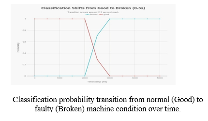
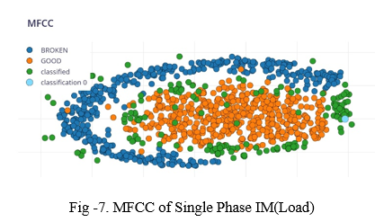
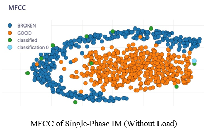

# 📊 Results – SmartEar System

All DSP processing, feature extraction (FFT, MFCC), and model training/testing were performed using `Edge Impulse Studio`, enabling efficient development and validation of the SmartEar system.

---

## 📈 1. Classification Probability Transition

The above graph illustrates the transition of classification probabilities from GOOD (normal) to BROKEN (faulty) machine condition over time.

Initially, the system maintains a high confidence (~1.0) for the GOOD class, indicating stable machine operation. At the onset of a fault, a sharp transition is observed where the GOOD probability decreases rapidly while the BROKEN probability rises to ~1.0.

This behavior confirms:
- Accurate detection of fault occurrence  
- High confidence predictions  
- Fast and reliable real-time response  

---

## 🔍 2. MFCC Feature Distribution (Without Load)

This plot represents the MFCC feature distribution under normal operating conditions (without load).

Observations:
- GOOD samples form a compact and well-defined cluster  
- BROKEN samples are clearly separated from GOOD  
- Minimal overlap between the two classes  

This indicates that MFCC features effectively capture machine acoustic characteristics, enabling strong class separability.

---

## ⚙️ 3. MFCC Feature Distribution (With Load)

This plot represents MFCC feature distribution under loaded (real-world) conditions.

Observations:
- Increased spread due to noise and load variations  
- Slight overlap between GOOD and BROKEN classes  
- Presence of scattered points due to environmental disturbances  

Despite these challenges, the system still maintains distinguishable class patterns, proving robustness in practical environments.

---

## ✅ Final Conclusion

- DSP pipeline (Filtering → FFT → MFCC) successfully extracts meaningful features  
- Clear separation between GOOD and BROKEN conditions  
- High-confidence predictions (~1.0 GOOD → ~0.98–1.0 BROKEN)  
- Reliable real-time fault detection  

The results obtained using `Edge Impulse Studio`, along with deployment on `ESP32`, validate SmartEar as a low-cost, scalable, and real-time Edge-AI solution for predictive maintenance.
